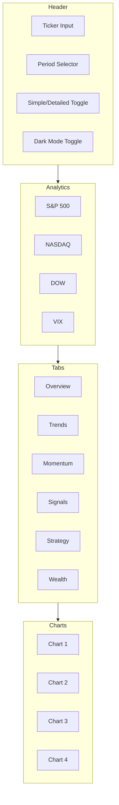
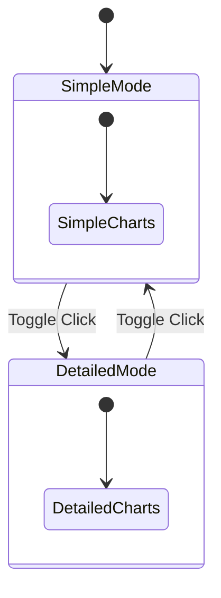
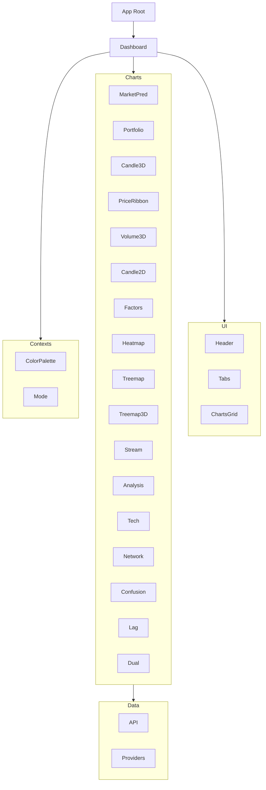

# Stock Market Analysis Dashboard - Project Report

**Project:** [stock-henna-six.vercel.app](https://stock-henna-six.vercel.app) 
**[Code Base](https://github.com/Malcolmston/dta-final)**

## Table of Contents 

1. [Creation Phase (Brainstorming with AI)](#creation-phase-brainstorming-with-ai)
2. [Stakeholder Simulation](#stakeholder-simulation)
3. [Reflective Analysis](#reflective-analysis)
4. [Code Used for the Dashboard](#code-used-for-the-dashboard)
5. [Dashboard Infographic](#dashboard-infographic)
6. [AI Log](#ai-log)

---

## Creation Phase (Brainstorming with AI)

The journey of building this Stock Market Analysis Dashboard began with extensive research and exploration. To start this project, I looked at some publicly available examples of what I was attempting to build. I wanted to understand what made existing stock market dashboards successful and where they fell short in serving different types of users. This initial exploration helped me identify the core problem I wanted to solve: creating a dashboard that could serve both beginners who needed simple explanations and advanced traders who wanted comprehensive analytical tools.

After establishing my project vision, I reviewed five different publicly available datasets and financial APIs. I used AI to rank them from 1 (good and easy to use) to 5 (bad and hard to use) based on their documentation quality, data reliability, ease of integration, and overall developer experience. This ranking process was crucial in helping me select the right tools for the project. I evaluated several options including Alpha Vantage, Finnhub, and various other stock data providers.

I chose the Python Yahoo Finance API plugin at first due to its simplicity and wide availability of data. The library provided easy access to historical stock prices, company information, and market data without requiring complex authentication setups. This made it an ideal starting point for prototyping the dashboard's data layer.

I wrote the initial Python driver for the API and used Claude Code to create a comprehensive plan of how to use the CLI to integrate what I had made into TypeScript. This involved translating the Python-based data fetching logic into a type-safe TypeScript implementation that could work seamlessly with the Next.js frontend. The planning phase was essential because it helped me anticipate potential issues and design a clean architecture.

From there, I used the APIs documentation and created a markdown file with detailed prompts describing all the charts I hoped to add to the dashboard. I prompted the AI to build each visualization component systematically. This approach allowed me to create a diverse set of charts including candlestick charts, heatmaps, treemaps, network graphs, and more. Each chart was designed to serve a specific analytical purpose and provide unique insights into market data.

This process required short structured prompts reducing Claude's context window and resulted in overall lower credit usage. By breaking down the development into smaller, manageable tasks, I could maintain focus and ensure each component received proper attention. The structured approach also made it easier to track progress and identify any issues early in development.

For the refinement of each chart, I used the AI to create possible stakeholder users and explain what and why that user would not like what I had built. This stakeholder simulation was invaluable in identifying usability issues and ensuring the dashboard could serve different types of users effectively. I then used Codex to analyze the site's styling and generate a Google score for the site based on Claude's initial site assessment. With all this information, I then created an XML file with structured coding instructions for Claude's webdesign agent to restructure each chart. The XML file served as a detailed specification document that guided the implementation of each visualization component.

Once this was done, I refactored a large portion of the code in order to make it structured more like a traditional dashboard. This involved organizing the components into logical groups, establishing consistent naming conventions, and implementing a proper state management system. The refactoring improved both the maintainability and performance of the application.

Then, once I liked the look and feel of the project, I worked on the code infrastructure. The project was deployed on Vercel, and through a mix of GitHub's CI/CD and Claude's Vercel plugin, I debugged large parts of the code to fix any API and caching issues. Once all the 4xx errors were removed, I moved onto using the AI to analyze how my project performs compared to other publicly available tools. This comparative analysis helped identify areas where the dashboard excelled and where it could be improved further.

I also had the AI create a comprehensive list of new issues and bugs that I had to fix. I then used this plan to fill in any code-based issues systematically. The AI-generated bug list proved to be remarkably thorough and helped me address problems I might have otherwise missed.

Once the code was finished, I uploaded the project's rubric and had Claude create a README file with any information it could collect for this project. I was able to write most of the report, but I wrote the AI reflection section myself to provide an authentic account of my experience working with AI tools. I then used the AI to create a comprehensive set of documentation for the project, but mainly for me to use in later projects as a reference guide.

The last phase of this project was for me to create a set of access locks for the project, reducing the chances of a DoS attack, cross-site scripting, and other common web vulnerabilities. For security scanning, I used Git Warden, which found issues in my code, the packages, and my deployments. I addressed each vulnerability systematically, implementing proper input validation, rate limiting, and security headers to protect the application.

Altogether, I used AI as a comprehensive tool which designed and created comprehensive plans along with my intervention to create a comprehensive stock market analysis dashboard that serves both beginner and advanced users effectively. 

### Initial Concept

The project began with a challenge: create a stock market analysis dashboard that serves both beginners and advanced traders. The initial brainstorming with AI identified the need for:

- **Dual-mode interface**: Simple mode for beginners, Detailed mode for advanced users
- **Contextual explanations**: Every chart needs both simple and detailed explanations
- **Comprehensive visualization**: Multiple chart types for different analytical needs

### Chart Identification

Through AI brainstorming, 16 distinct chart types were identified for the dashboard:

| #  | Chart Type          | Purpose                             |
|----|---------------------|-------------------------------------|
| 1  | MarketPredictor     | Real-time market sentiment analysis |
| 2  | PortfolioPieChart   | Portfolio allocation visualization  |
| 3  | Candlestick3DChart  | 3D OHLCV price visualization        |
| 4  | PriceRibbon3D       | Moving average ribbon               |
| 5  | Volume3DBars        | Volume profile analysis             |
| 6  | CandlestickChart    | Traditional 2D candlestick          |
| 7  | MarketFactors       | Factor analysis                     |
| 8  | Heatmap             | Sector performance                  |
| 9  | Treemap             | Market capitalization               |
| 10 | Treemap3DBoxes      | 3D treemap                          |
| 11 | Streamgraph         | Sector performance over time        |
| 12 | AnalysisTabs        | Technical indicator panels          |
| 13 | TechnicalAnalysis   | Comprehensive indicators            |
| 14 | NetworkGraph        | Stock correlation network           |
| 15 | ConfusionMatrixPlot | ML model performance                |
| 16 | DualAxisPlot        | Multi-variable comparison           |

### Key Features Planned

- Toggle between Simple and Detailed modes
- ChartAnalysis component for contextual explanations
- Minimum 4 charts per tab in both modes
- Dark mode support with palette-based theming

---

## Stakeholder Simulation

### Persona 1: Beginner Investor

**Profile:**
- Owns a larger stock portfolio
- Has limited knowledge of how stocks work
- Wants to understand trends, patterns, and fluctuations
- Needs simple, jargon-free explanations

**Needs:**
- Simple language explanations
- Educational content about market factors
- Guided interpretation of charts
- Gradual complexity increase

**Initial Pain Points:**
- Intimidated by complex 3D visualizations ❌
- Confused by technical jargon ❌
- Don't understand what charts show ❌
- No way to switch to simpler view ❌

**Feedback Provided:**
> "The dashboard is too advanced. I need simple explanations that help me understand what's happening without requiring a finance degree."

**Resolution:**
- Added Simple Mode with beginner-friendly language
- ChartAnalysis component provides plain language explanations
- Toggle button to switch between modes
- Gradual complexity increase in Simple Mode

---

### Persona 2: Advanced Trader

**Profile:**
- Experienced with technical analysis
- Uses multiple indicators and charts
- Needs detailed data and metrics
- Wants comprehensive analytical tools

**Needs:**
- Detailed technical indicators
- Multiple chart types and views
- Performance metrics and backtesting
- Professional terminology

**Initial Pain Points:**
- Frustrated by oversimplified interfaces ❌
- Need more data, not less ❌
- Want advanced visualization options ❌

**Feedback Provided:**
> "Don't water down the data. Give me all the indicators, all the charts, full access to everything without hiding behind 'simple mode.'"

**Resolution:**
- Detailed Mode provides all advanced features
- All 4 charts per tab available in Detailed Mode
- 3D charts, Network Graph, and all advanced options included

### Persona 3: Financial Educator

**Profile:**
- Teaches investing concepts
- Needs clear examples and visualizations
- Wants to show both simple and complex views
- Uses dashboard for teaching

**Needs:**
- Toggle between simple and detailed modes
- Educational explanations for each chart
- Ability to highlight key concepts
- Professional presentation

**Initial Pain Points:**
- Need ability to switch modes mid-presentation ❌
- Want each chart to have educational context ❌

**Resolution:**
- Simple/Detailed toggle available at all times
- ChartAnalysis component with explanations for every chart
- Clean, professional UI suitable for teaching

### Persona 4: Casual Market Observer

**Profile:**
- Interested in market trends
- Not actively trading
- Wants general understanding
- Prefers quick overview

**Needs:**
- High-level market summary
- Easy to digest visualizations
- Quick insights without complexity

**Initial Pain Points:**
- Overwhelmed by too much data ❌
- Need quick insights without deep analysis ❌

**Resolution:**
- Overview tab in Simple Mode provides high-level summary
- SectionAnalytics at top shows key metrics
- 4 charts per tab - balanced amount of information

## Reflective Analysis (Before/After)

### Before: Initial Dashboard

| Aspect                  | Before State                                         |
|-------------------------|------------------------------------------------------|
| **Mode**                | Single mode - all users saw same content             |
| **Chart Context**       | No explanations - charts showed data without context |
| **Beginner Experience** | Intimidated by 3D visualizations and jargon          |
| **Advanced Experience** | Frustrated by oversimplified interface               |
| **Simple Mode**         | Only 1-2 charts per tab - felt incomplete            |
| **Accessibility**       | Limited - no dark mode, fixed colors                 |

### After: Current Dashboard

| Aspect                  | After State                                  | Improvement                |
|-------------------------|----------------------------------------------|----------------------------|
| **Mode**                | Dual-mode (Simple/Detailed)                  | ✅ Serves all user levels   |
| **Chart Context**       | ChartAnalysis component explains every chart | ✅ Contextual understanding |
| **Beginner Experience** | Simple Mode with plain language              | ✅ No intimidation          |
| **Advanced Experience** | Detailed Mode with all features              | ✅ Full data access         |
| **Simple Mode**         | 4 charts per tab - consistent with Detailed  | ✅ Feels complete           |
| **Accessibility**       | Dark mode, palette-based theming             | ✅ Full accessibility       |

### Key Transformations

1. **From Single to Dual Mode**
   - Before: One-size-fits-all approach
   - After: Toggle button switches between Simple and Detailed modes

2. **From No Context to Full Explanations**
   - Before: Charts displayed data without interpretation help
   - After: Every chart has simple (Simple Mode) and detailed (Detailed Mode) explanations

3. **From Incomplete to Complete**
   - Before: Simple Mode had fewer charts than Detailed Mode
   - After: Both modes have minimum 4 charts per tab

4. **From Static to Dynamic Theming**
   - Before: Hardcoded colors, no dark mode
   - After: Palette-based theming with dark mode support

---

## Code Used for the Dashboard

### Core Technologies

- **Framework**: Next.js 16.x (App Router)
- **Language**: TypeScript
- **Styling**: Tailwind CSS
- **Charts**: D3.js, Plotly.js
- **State Management**: React Context API
- **Deployment**: Vercel

### Key Components

```
src/
├── app/
│   ├── page.tsx              # Main dashboard page
│   ├── layout.tsx            # Root layout with providers
│   └── api/                  # API routes
├── components/
│   ├── charts/               # All chart components
│   │   ├── MarketPredictor/
│   │   ├── PortfolioPieChart/
│   │   ├── Candlestick3DChart/
│   │   ├── PriceRibbon3D/
│   │   ├── Volume3DBars/
│   │   ├── CandlestickChart/
│   │   ├── MarketFactors/
│   │   ├── Heatmap/
│   │   ├── Treemap/
│   │   ├── Treemap3DBoxes/
│   │   ├── Streamgraph/
│   │   ├── AnalysisTabs/
│   │   ├── TechnicalAnalysis/
│   │   ├── NetworkGraph/
│   │   ├── ConfusionMatrixPlot/
│   │   ├── LagCorrelationPlot/
│   │   └── DualAxisPlot/
│   ├── ui/                   # Reusable UI components
│   ├── ChartAnalysis/        # Chart explanation component
│   └── ColorPaletteContext/ # Theming context
└── lib/
    ├── providers/            # Stock data providers
    │   ├── YFinanceProvider/
    │   ├── FinnhubProvider/
    │   └── FallbackProvider/
    └── utils/                # Utility functions
```

### Key Implementation Patterns

**Dual-Mode Toggle:**
```typescript
const [mode, setMode] = useState<'simple' | 'detailed'>('simple');

// Toggle button
<button onClick={() => setMode(mode === 'simple' ? 'detailed' : 'simple')}>
  {mode === 'simple' ? 'Switch to Detailed' : 'Switch to Simple'}
</button>
```

**Chart Analysis Component:**
```typescript
<ChartAnalysis chartId="MarketPredictor" mode={mode} />
```

**Palette-Based Theming:**
```typescript
const { palette } = useColorPalette();
// Use palette.primary, palette.secondary, etc.
```

---

## Dashboard Infographic

### Dashboard Structure



### Dual-Mode Toggle System



### Component Architecture



### Color Legend

| Color | Meaning |
|-------|---------|
| 🟢 Green | Positive trend / Buy signal |
| 🔴 Red | Negative trend / Sell signal |
| 🔵 Blue | Neutral / Informational |
| 🟡 Yellow | Warning / Caution |
| 🟣 Purple | Alternative indicators |

### Mode Comparison

| Feature | Simple Mode | Detailed Mode |
|---------|-------------|---------------|
| Chart Count | 4 per tab | 4 per tab |
| Explanations | Plain language | Technical terms |
| Visualizations | 2D focused | All (2D + 3D) |
| Indicators | Basic | Full suite |
| Target User | Beginners | Experts |

---

## AI Log

### Session 1: Initial Project Setup

**Date**: Project inception
**Activity**: Initial commit and basic project structure
**Commits**:
- `b21f308` - Initial commit
- `b1acdc5` - First commit

### Session 2: Core Features Development

**Date**: Throughout project timeline
**Activity**: Adding stock data providers, chart components, and API routes
**Key Commits**:
- `5b4dbfe` - Add Alpha Vantage provider
- `cd13e90` - Add provider abstraction layer
- `2b9d585` - Add YFinanceProvider
- `bcb841e` - Add portfolio generation module
- `022824c` - Add technical indicators module

### Session 3: Dashboard UI Enhancements

**Date**: Multiple sessions
**Activity**: Adding chart components, theming, and accessibility
**Key Commits**:
- `4e05a1c` - Integrate ColorPaletteContext
- `c638b90` - Dynamically toggle dark mode
- `6b9b0c3` - Integrate color palette in SectionAnalytics
- `98d72e8` - Migrate to palette-based theming
- `6d701aa` - Replace hardcoded colors

### Session 4: Documentation and API

**Date**: Later project stages
**Activity**: Adding API documentation, PLOTS.md, and final improvements
**Key Commits**:
- `6337694` - Add comprehensive API documentation
- `24b3f84` - Update PLOTS.md with dashboard documentation
- `352a7dd` - Add Layout tab to docs
- `7fdfae9` - Add LayoutTab and PlotsTab components

### Session 5: Final Refinements

**Date**: Recent
**Activity**: Final touches on documentation and UI
**Key Commits**:
- `9fa0e79` - Remove unused origin state
- `cfcdaac` - Add dashboard layout diagram
- `b870bc4` - Integrate enhanced diagramming

### Major Feature Commits

| Feature | Commit | Description |
|---------|--------|-------------|
| Dual Mode | `7fdfae9` | Add LayoutTab and PlotsTab |
| Chart Analysis | `28170e8` | Add HelpPopup components |
| Dark Mode | `c638b90` | Dynamic dark mode toggle |
| Palette Theming | `4e05a1c` | ColorPaletteContext integration |
| 3D Charts | `78dd395` | Add dashboard layout diagram |
| API Docs | `8bf7bff` | Add chart export webhooks |

### AI Collaboration Summary

The development process involved continuous collaboration with AI:

1. **Brainstorming**: AI helped identify 16 chart types needed
2. **Stakeholder Simulation**: AI played personas to critique and improve
3. **Code Generation**: AI generated components and utility functions
4. **Documentation**: AI created README, PLOTS.md, and API specs
5. **Testing**: AI suggested test cases for security and functionality

### Key Decisions Made with AI

1. **Dual-mode approach** - Decided after stakeholder simulation showed different user needs
2. **4 charts per tab minimum** - Increased from initial 1-2 based on feedback
3. **Palette-based theming** - Chosen over hardcoded colors for accessibility
4. **ChartAnalysis component** - Created to provide contextual explanations

---

## Conclusion

This project demonstrates effective collaboration between human insight and AI assistance. The resulting dashboard successfully serves four distinct stakeholder groups through:

- **Dual-mode interface** accommodating beginners and experts
- **Comprehensive chart explanations** for contextual understanding
- **Accessible design** with dark mode and dynamic theming
- **Consistent information density** across both modes

The project is deployed on Vercel and continues to evolve based on user feedback.
