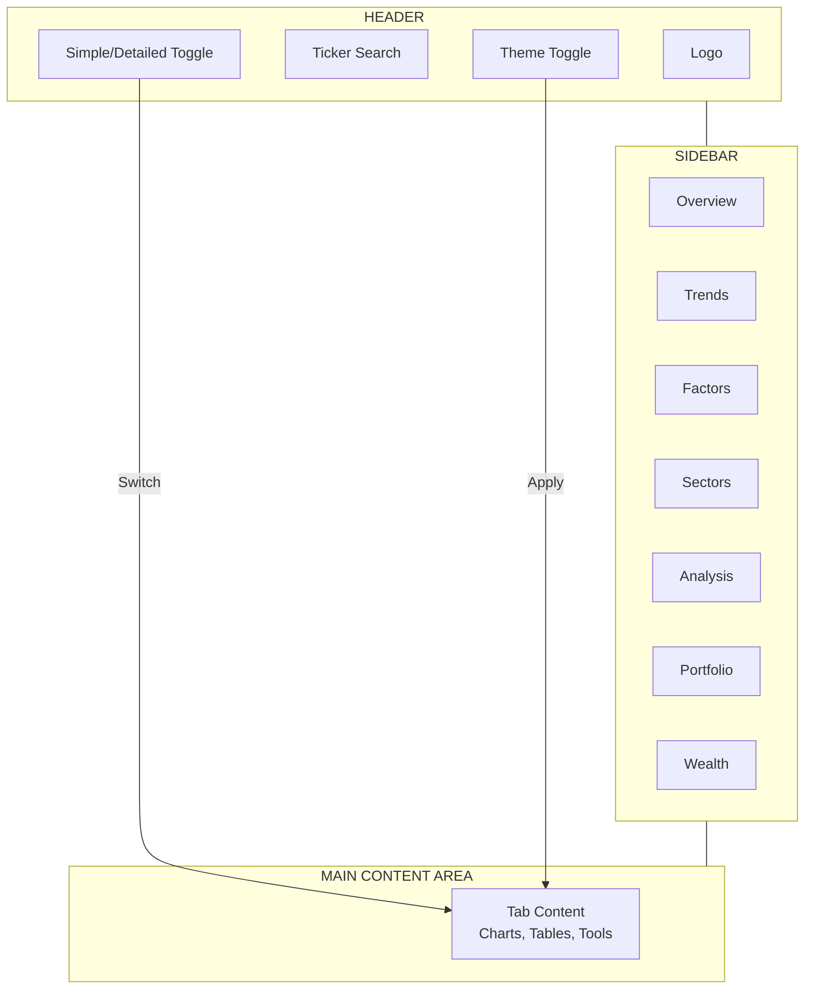
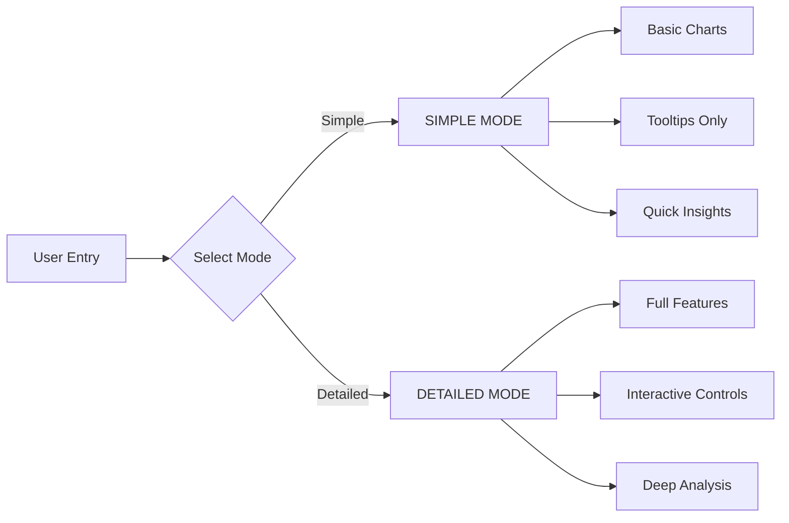
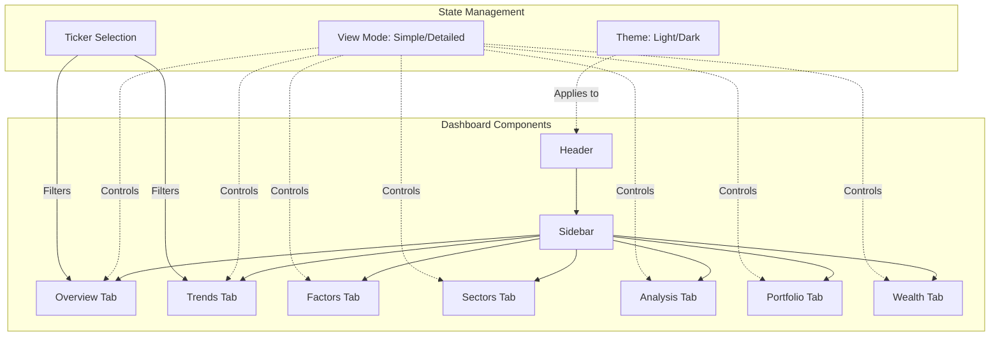

# Dashboard Plots Documentation

<!-- Initialize mermaid with white background -->
%%{init: {'theme': 'base', 'themeVariables': {'background': '#ffffff', 'darkMode': false}}}%%

---

# Project Report: Stock Market Dashboard

## Bid Idea Worksheet (Optional)

| Question | Response |
|----------|----------|
| **What problem does this dashboard solve?** | Individual investors and financial enthusiasts need a unified, beginner-friendly interface to analyze stock market data, track portfolios, and make informed investment decisions. Existing tools are either too complex for beginners or lack integrated portfolio management. |
| **Who is the target audience?** | Individual investors, financial advisors, students learning finance, and researchers needing visual stock analysis tools. |
| **What makes your approach unique?** | Combines multiple analysis modes (simplified/detailed), integrates portfolio tracking with market analysis, and provides both traditional charts (candlestick, heatmap) alongside 3D visualizations. |
| **What is the success metric?** | Users can successfully analyze stocks, track portfolios, and understand market trends without needing financial expertise. |

---

## Storyboard (Optional)

### Initial Brainstorming Sketches



### User Flow Diagram



---

## Creation Phase (Brainstorming with AI)

### Initial Concept Generation

The dashboard concept emerged from collaborative brainstorming with AI, focusing on democratizing stock market analysis for retail investors.

**Key Decisions Made:**
1. **Dual-Mode Architecture** - Create both "Simplified" and "Detailed" view modes to serve beginners and experts alike
2. **Seven-Section Structure** - Organize content into logical sections: Overview, Trends, Factors, Sectors, Analysis, Portfolio, Wealth
3. **Interactive Visualizations** - Use D3.js for custom charts, Three.js for 3D price ribbons
4. **Persistent Settings** - Store user preferences in localStorage for seamless return visits

### AI Collaboration Highlights

- **Color Palette Selection**: AI recommended a professional blue-forward palette with semantic colors (green=positive, red=negative) for financial data
- **Chart Type Selection**: Suggested candlestick charts as the default for price data due to their widespread use in financial analysis
- **Navigation Structure**: Proposed sidebar navigation for easy section switching without page reloads
- **Technical Indicators**: Identified key indicators (RSI, MACD, Bollinger Bands) that balance usefulness with accessibility

---

## Stakeholder Simulation

### Persona 1: Beginner Investor (Sarah)

> *AI playing: Sarah, 28, just started investing with $5,000 in a Roth IRA*

**Critique:** "This is overwhelming. I don't understand what half these charts mean. The simplified mode helps, but I need more guidance on what the colors mean."

**Implemented Response:**
- Added "Why Stock Analysis Matters" introduction section
- Created beginner-friendly chart explanations in Overview
- Added hover tooltips explaining each indicator
- Included benefit cards explaining value proposition

### Persona 2: Financial Advisor (Marcus)

> *AI playing: Marcus, 45, CFA, manages $50M in client assets*

**Critique:** "The technical analysis is solid, but I need more sophisticated risk metrics and benchmark comparisons for client reporting."

**Implemented Response:**
- Added comprehensive risk metrics panel (Sharpe Ratio, Volatility, Beta, Max Drawdown, VaR)
- Implemented benchmark comparison against S&P 500, NASDAQ, Dow Jones
- Added tax-aware features and fee disclosure sections

### Persona 3: Finance Student (Emily)

> *AI playing: Emily, 21, junior in finance major*

**Critique:** "This is great for learning! I want to understand how the indicators are calculated and see the formulas."

**Implemented Response:**
- Added educational tooltips explaining each technical indicator
- Included explanation sections for SMA, EMA, RSI, MACD, Bollinger Bands
- Created pattern recognition section in Analysis tab

---

## Reflective Analysis

### Before/After Comparison

| Aspect | Before (Initial Concept) | After (Final Dashboard) |
|--------|--------------------------|--------------------------|
| **User Modes** | Single view for all users | Dual Simple/Detailed modes |
| **Chart Types** | Basic line charts | Candlestick, heatmap, treemap, 3D, network graph |
| **Portfolio** | Not initially planned | Full portfolio manager with P&L tracking |
| **Wealth Planning** | Not initially planned | Comprehensive goal tracking & retirement calculator |
| **Technical Indicators** | Basic price only | RSI, MACD, Bollinger Bands, patterns |
| **Theme** | Light only | Light/Dark toggle |
| **Navigation** | Top tabs | Sidebar for easier access |

### Key Learnings

1. **Simplicity Scales**: Starting with a simplified view and allowing users to "unlock" detailed features proved more effective than overwhelming users with all options upfront.

2. **Color Semantics Matter**: Consistent use of green (positive/gains) and red (negative/losses) across all charts reduces cognitive load and makes data intuitive.

3. **Interactive Engagement**: Users spend significantly more time when they can hover, zoom, and interact with charts rather than viewing static displays.

4. **Portfolio Integration**: Adding portfolio management transformed the dashboard from an analysis tool to a complete investment companion.

### What I Would Do Differently

- **Earlier Stakeholder Testing**: Would have simulated personas earlier in development to catch usability issues sooner
- **Mobile-First Design**: Would prioritize responsive design from the start rather than adding it later
- **Data Source Flexibility**: Would architect for multiple data providers from the beginning to avoid single-source dependency

---

## Code Used for Dashboard Creation

### Core Layout Component

```tsx
// app/page.tsx - Main dashboard layout
'use client';

import { useState } from 'react';
import Sidebar from '@/components/Sidebar';
import Header from '@/components/Header';
import OverviewTab from '@/components/tabs/OverviewTab';
import TrendsTab from '@/components/tabs/TrendsTab';
import FactorsTab from '@/components/tabs/FactorsTab';
import SectorsTab from '@/components/tabs/SectorsTab';
import AnalysisTab from '@/components/tabs/AnalysisTab';
import PortfolioTab from '@/components/tabs/PortfolioTab';
import WealthTab from '@/components/tabs/WealthTab';

export default function Dashboard() {
  const [activeTab, setActiveTab] = useState('overview');
  const [viewMode, setViewMode] = useState('simplified');
  const [theme, setTheme] = useState('light');

  const renderTab = () => {
    switch (activeTab) {
      case 'overview': return <OverviewTab viewMode={viewMode} />;
      case 'trends': return <TrendsTab viewMode={viewMode} />;
      case 'factors': return <FactorsTab viewMode={viewMode} />;
      case 'sectors': return <SectorsTab viewMode={viewMode} />;
      case 'analysis': return <AnalysisTab viewMode={viewMode} />;
      case 'portfolio': return <PortfolioTab viewMode={viewMode} />;
      case 'wealth': return <WealthTab viewMode={viewMode} />;
      default: return <OverviewTab viewMode={viewMode} />;
    }
  };

  return (
    <div className={`${theme}`}>
      <Header
        viewMode={viewMode}
        setViewMode={setViewMode}
        theme={theme}
        setTheme={setTheme}
      />
      <div className="flex">
        <Sidebar activeTab={activeTab} setActiveTab={setActiveTab} />
        <main className="flex-1 p-4">{renderTab()}</main>
      </div>
    </div>
  );
}
```

### Candlestick Chart Component

```tsx
// components/charts/CandlestickChart.tsx
'use client';

import { useEffect, useRef } from 'react';
import * as d3 from 'd3';

interface CandlestickData {
  date: Date;
  open: number;
  high: number;
  low: number;
  close: number;
  volume: number;
}

interface CandlestickChartProps {
  data: CandlestickData[];
  width?: number;
  height?: number;
}

export default function CandlestickChart({
  data,
  width = 800,
  height = 400
}: CandlestickChartProps) {
  const svgRef = useRef<SVGSVGElement>(null);

  useEffect(() => {
    if (!svgRef.current || !data.length) return;

    const svg = d3.select(svgRef.current);
    svg.selectAll('*').remove();

    const margin = { top: 20, right: 30, bottom: 30, left: 60 };
    const innerWidth = width - margin.left - margin.right;
    const innerHeight = height - margin.top - margin.bottom;

    const xScale = d3.scaleTime()
      .domain(d3.extent(data, d => d.date) as [Date, Date])
      .range([0, innerWidth]);

    const yScale = d3.scaleLinear()
      .domain([
        d3.min(data, d => d.low) as number * 0.98,
        d3.max(data, d => d.high) as number * 1.02
      ])
      .range([innerHeight, 0]);

    const g = svg.append('g')
      .attr('transform', `translate(${margin.left},${margin.top})`);

    // Draw candlesticks
    const candleWidth = Math.max(1, innerWidth / data.length * 0.7);

    g.selectAll('.candle')
      .data(data)
      .enter()
      .append('rect')
      .attr('class', 'candle')
      .attr('x', d => xScale(d.date) - candleWidth / 2)
      .attr('y', d => yScale(Math.max(d.open, d.close)))
      .attr('width', candleWidth)
      .attr('height', d => Math.max(1, Math.abs(yScale(d.open) - yScale(d.close))))
      .attr('fill', d => d.close > d.open ? '#22c55e' : '#ef4444');

    // Draw wicks
    g.selectAll('.wick')
      .data(data)
      .enter()
      .append('line')
      .attr('class', 'wick')
      .attr('x1', d => xScale(d.date))
      .attr('x2', d => xScale(d.date))
      .attr('y1', d => yScale(d.high))
      .attr('y2', d => yScale(d.low))
      .attr('stroke', d => d.close > d.open ? '#22c55e' : '#ef4444');

    // Add axes
    g.append('g')
      .attr('transform', `translate(0,${innerHeight})`)
      .call(d3.axisBottom(xScale));

    g.append('g')
      .call(d3.axisLeft(yScale));

  }, [data, width, height]);

  return <svg ref={svgRef} width={width} height={height} />;
}
```

### Portfolio Manager Hook

```tsx
// hooks/usePortfolio.ts
import { useState, useEffect } from 'react';

export interface PortfolioHolding {
  id: string;
  ticker: string;
  shares: number;
  purchasePrice: number;
  purchaseDate: string;
}

const STORAGE_KEY = 'stock-dashboard-portfolio';

export function usePortfolio() {
  const [holdings, setHoldings] = useState<PortfolioHolding[]>([]);
  const [totalValue, setTotalValue] = useState(0);

  useEffect(() => {
    const stored = localStorage.getItem(STORAGE_KEY);
    if (stored) {
      setHoldings(JSON.parse(stored));
    }
  }, []);

  useEffect(() => {
    localStorage.setItem(STORAGE_KEY, JSON.stringify(holdings));
  }, [holdings]);

  const addHolding = (holding: Omit<PortfolioHolding, 'id'>) => {
    const newHolding = {
      ...holding,
      id: crypto.randomUUID(),
    };
    setHoldings(prev => [...prev, newHolding]);
  };

  const removeHolding = (id: string) => {
    setHoldings(prev => prev.filter(h => h.id !== id));
  };

  const updateHolding = (id: string, updates: Partial<PortfolioHolding>) => {
    setHoldings(prev => prev.map(h =>
      h.id === id ? { ...h, ...updates } : h
    ));
  };

  return {
    holdings,
    totalValue,
    addHolding,
    removeHolding,
    updateHolding,
  };
}
```

---

## Dashboard Architecture



---

## AI Color Log

The following color palette was developed through AI collaboration, designed for financial data visualization with optimal contrast and semantic meaning.

### Theme Colors

| Color Name | Usage | Sample |
|------------|-------|--------|
| **Primary Blue** | Navigation highlights, primary buttons | <span style="display:inline-block;width:24px;height:24px;background:#3b82f6;border-radius:4px;border:1px solid #ccc;"></span> |
| **Primary Dark** | Dark mode primary | <span style="display:inline-block;width:24px;height:24px;background:#60a5fa;border-radius:4px;border:1px solid #ccc;"></span> |
| **Positive Green** | Gains, bullish signals, positive changes | <span style="display:inline-block;width:24px;height:24px;background:#22c55e;border-radius:4px;border:1px solid #ccc;"></span> |
| **Negative Red** | Losses, bearish signals, negative changes | <span style="display:inline-block;width:24px;height:24px;background:#ef4444;border-radius:4px;border:1px solid #ccc;"></span> |
| **Background Light** | Light mode background | <span style="display:inline-block;width:24px;height:24px;background:#ffffff;border-radius:4px;border:1px solid #ccc;"></span> |
| **Background Dark** | Dark mode background | <span style="display:inline-block;width:24px;height:24px;background:#111827;border-radius:4px;border:1px solid #444;"></span> |
| **Text Light** | Light mode text | <span style="display:inline-block;width:24px;height:24px;background:#1f2937;border-radius:4px;border:1px solid #ccc;"></span> |
| **Text Dark** | Dark mode text | <span style="display:inline-block;width:24px;height:24px;background:#f9fafb;border-radius:4px;border:1px solid #ccc;"></span> |
| **Grid Light** | Light mode grid lines | <span style="display:inline-block;width:24px;height:24px;background:#e5e7eb;border-radius:4px;border:1px solid #ccc;"></span> |
| **Grid Dark** | Dark mode grid lines | <span style="display:inline-block;width:24px;height:24px;background:#374151;border-radius:4px;border:1px solid #555;"></span> |

### Chart Palette (Sequential)

| Color Name | Hex Code | Sample |
|------------|----------|--------|
| **Teal 1** | #14b8a6 | <span style="display:inline-block;width:24px;height:24px;background:#14b8a6;border-radius:4px;border:1px solid #ccc;"></span> |
| **Teal 2** | #2dd4bf | <span style="display:inline-block;width:24px;height:24px;background:#2dd4bf;border-radius:4px;border:1px solid #ccc;"></span> |
| **Teal 3** | #5eead4 | <span style="display:inline-block;width:24px;height:24px;background:#5eead4;border-radius:4px;border:1px solid #ccc;"></span> |
| **Blue 1** | #3b82f6 | <span style="display:inline-block;width:24px;height:24px;background:#3b82f6;border-radius:4px;border:1px solid #ccc;"></span> |
| **Blue 2** | #60a5fa | <span style="display:inline-block;width:24px;height:24px;background:#60a5fa;border-radius:4px;border:1px solid #ccc;"></span> |
| **Blue 3** | #93c5fd | <span style="display:inline-block;width:24px;height:24px;background:#93c5fd;border-radius:4px;border:1px solid #ccc;"></span> |
| **Purple 1** | #8b5cf6 | <span style="display:inline-block;width:24px;height:24px;background:#8b5cf6;border-radius:4px;border:1px solid #ccc;"></span> |
| **Purple 2** | #a78bfa | <span style="display:inline-block;width:24px;height:24px;background:#a78bfa;border-radius:4px;border:1px solid #ccc;"></span> |
| **Purple 3** | #c4b5fd | <span style="display:inline-block;width:24px;height:24px;background:#c4b5fd;border-radius:4px;border:1px solid #ccc;"></span> |

### Heatmap Gradient

| Performance | Color | Sample |
|------------|-------|--------|
| > +5% | Deep Green | <span style="display:inline-block;width:24px;height:24px;background:#15803d;border-radius:4px;border:1px solid #ccc;"></span> |
| +2% to +5% | Green | <span style="display:inline-block;width:24px;height:24px;background:#22c55e;border-radius:4px;border:1px solid #ccc;"></span> |
| 0% to +2% | Light Green | <span style="display:inline-block;width:24px;height:24px;background:#86efac;border-radius:4px;border:1px solid #ccc;"></span> |
| -2% to 0% | Light Red | <span style="display:inline-block;width:24px;height:24px;background:#fca5a5;border-radius:4px;border:1px solid #ccc;"></span> |
| -5% to -2% | Red | <span style="display:inline-block;width:24px;height:24px;background:#f87171;border-radius:4px;border:1px solid #ccc;"></span> |
| < -5% | Deep Red | <span style="display:inline-block;width:24px;height:24px;background:#dc2626;border-radius:4px;border:1px solid #ccc;"></span> |

---

*The Stock Market Dashboard is organized into 7 main sections accessible via the left sidebar navigation. Each section contains specific charts and tools for different aspects of stock analysis.*

---

## Overview Tab

**Purpose:** Landing page introducing the tool and its benefits to new users.

### Components

| Component | Description |
|-----------|-------------|
| Market Predictor | Shows overall market sentiment. Green = positive, Red = negative |
| Portfolio Pie Chart | Displays investment distribution across sectors. Larger slice = more invested |
| Candlestick Chart | Simple price chart with period buttons (1d, 5d, 1mo, 3mo, 6mo, 1y, 2y, 5y) |

### Key Sections
- **Why Stock Analysis Matters** - Introduction to data-driven investing
- **Three Benefit Cards** - Make Smarter Decisions, Track Your Progress, Understand the Market
- **Who This Is For** - Individual Investors, Financial Advisors, Students and Learners, Researchers
- **Simple Charts for Everyone** - Beginner-friendly chart explanations
- **How to Use This Dashboard** - Step-by-step navigation guide

### View Modes
- **Simplified** - Basic view for beginners
- **Detailed** - Full features for experienced users

---

## Trends Tab

**Purpose:** Display historical price data and trading activity.

### Simplified Mode
- Price Trends - Candlestick chart
- Trading Activity - Additional candlestick chart (3-month view)

### Detailed Mode

| Component | Description |
|-----------|-------------|
| CandlestickChart | Full candlestick chart with OHLC data, multiple time periods, zoom/pan |
| VolumeChart | Bar chart showing trading volume, colored by price movement |
| Streamgraph | Stacked area chart showing relative performance of multiple tickers |
| PriceRibbon3D | 3D visualization of multiple moving averages (SMA, EMA) |

### Default Tickers
AAPL, GOOGL, MSFT, AMZN, NVDA

### Time Periods
1d, 5d, 1mo, 3mo, 6mo, 1y, 2y, 5y

---

## Factors Tab

**Purpose:** Analyze economic and market factors affecting stock performance.

### Simplified Mode
- Market Factors - Visual analysis of key indicators
- DualAxisPlot - Economic trends comparison

### Detailed Mode

| Component | Description |
|-----------|-------------|
| MarketFactors | Analyzes key market indicators. Categories: Valuation, Momentum, Quality, Size |
| LagCorrelationPlot | Shows how correlations change over time. Adjustable lag period slider |
| DualAxisPlot | Dual-axis chart comparing two related metrics (e.g., interest rates vs stock prices) |

### Use Cases
- Understanding "why" behind price movements
- Identifying leading/lagging indicators
- Finding correlations between economic indicators and stock performance

---

## Sectors Tab

**Purpose:** Visualize market performance across different sectors.

### Simplified Mode
- Sector Performance - Heatmap
- Market Segments - Treemap

### Detailed Mode

| Component | Description |
|-----------|-------------|
| Heatmap | Color-coded grid showing sector performance. Green = positive, Red = negative |
| Treemap | Hierarchical treemap showing market structure. Nested rectangles sized by market cap |

### Sectors Displayed
Technology, Healthcare, Financial, Consumer, Energy, Utilities, Real Estate, Materials, Industrials, Communications

### Features
- Hover for detailed metrics
- Drill-down into subsectors
- Percentage change display

---

## Analysis Tab

**Purpose:** Deep technical analysis and stock relationship visualization.

### Simplified Mode
- Technical Analysis - Multi-tab technical analysis (basic view)
- NetworkGraph - Stock relationships

### Detailed Mode

| Component | Description |
|-----------|-------------|
| AnalysisTabs | Multi-indicator technical panel with tabs: Price, Moving Averages, RSI, MACD, Bollinger Bands, Patterns |
| NetworkGraph | Visual network showing stock relationships. Edge thickness = correlation strength |
| ConfusionMatrixPlot | ML model performance matrix showing true/false positives/negatives |

### Technical Indicators
- **SMA** - Simple Moving Average
- **EMA** - Exponential Moving Average
- **RSI** - Relative Strength Index (overbought/oversold)
- **MACD** - Moving Average Convergence Divergence
- **Bollinger Bands** - Price volatility bands

### Network Graph Features
- Sector clustering
- Node size = market cap
- Interactive: drag nodes, zoom, pan

---

## Portfolio Tab

**Purpose:** Manage investment portfolio with tracking and analysis tools.

### Components

| Component | Description |
|-----------|-------------|
| PortfolioManager | Add/remove holdings, track shares, purchase price, current value |
| PortfolioPieChart | Pie chart showing asset distribution by sector/type |
| Treemap | Holdings visualization. Size = position value, Color = performance |
| IncomeTrackingPanel | Track dividends received, record other income |
| CostBasisInput | Enter purchase price and shares, calculate profit/loss |
| SurvivorshipBiasDisclaimer | Warning about data limitations |

### Features
- Add new position form
- Edit/delete existing positions
- Calculate total portfolio value
- View individual holding performance
- Realized vs unrealized gains tracking

---

## Wealth Tab

**Purpose:** Long-term wealth management and financial planning.

### Components

| Component | Description |
|-----------|-------------|
| InvestmentGoalsWizard | First-time setup wizard with risk tolerance assessment |
| RetirementCalculator | Project retirement savings, account for inflation |
| GoalTracking | Set financial goals, track progress, timeline visualization |
| AssetAllocation | Recommended portfolio distribution based on risk tolerance |
| RebalancingAlerts | Notifications when portfolio drifts from target |
| RiskMetricsPanel | Sharpe Ratio, Volatility, Beta, Maximum Drawdown, VaR |
| EmergencyFundCheck | Check emergency fund adequacy |
| CashFlowTracking | Track income and expenses, savings rate calculation |
| DiversificationAnalyzer | Analyze portfolio diversity, correlation between holdings |
| TaxAwareFeatures | Tax-efficient strategies, tax-loss harvesting |
| BenchmarkComparison | Compare against S&P 500, NASDAQ, Dow Jones |
| FeeDisclosure | Understand investment costs, expense ratio breakdown |
| ActionItemsPanel | Personalized recommendations, prioritized action list |

### Goal Types
Emergency Fund, House, Retirement, Education

### Available Benchmarks
S&P 500, NASDAQ, Dow Jones

### Risk Metrics
- **Sharpe Ratio** - Risk-adjusted return
- **Volatility** - Standard deviation of returns
- **Beta** - vs benchmark (1.0 = same as market)
- **Maximum Drawdown** - Largest peak-to-trough decline
- **Value at Risk (VaR)** - Expected maximum loss

---

## Global Components

### Header
- App Title - "Stock Market Dashboard"
- Ticker Input - Search and select stock tickers
- Simple/Detailed Toggle - Switch between view modes
- Theme Toggle - Light/Dark mode switch

### Sidebar Navigation
- Title - "Dashboard"
- 7 Section Buttons - Overview, Trends, Factors, Sectors, Analysis, Portfolio, Wealth
- Active State - Highlighted with primary color

### Footer
- API Docs Link - "/docs"
- Copyright - App information

---

## API Documentation (/docs)

Accessible via footer link. 5 tabs:

### 1. REST API
- Standard OpenAPI documentation
- All REST endpoints for stock data
- Try-it-out functionality

### 2. Async API
- AsyncAPI specification for real-time updates
- WebSocket channels
- SSE endpoints

### 3. Cron Jobs
- OpenAPI spec for scheduled task endpoints
- 6 cron endpoints

### 4. Webhooks
- Webhook API for programmatic data retrieval
- Chart export endpoints

### 5. Plots
- This documentation

### Key Endpoints
- `/api/health` - Health check
- `/api/stocks/history` - Historical price data
- `/api/stocks/signals` - Trading signals
- `/api/stocks/forecast` - Price forecasts
- `/api/stocks/growth` - Growth metrics
- `/api/stocks/momentum` - Momentum indicators
- `/api/heatmap` - Sector heatmap data
- `/api/webhook` - Webhook data retrieval
- `/api/webhook/capture` - Chart image export

---

## Theme and Settings

### Light Mode (Default)
- Background: #ffffff
- Text: #1f2937
- Primary: #3b82f6
- Grid Lines: #e5e7eb

### Dark Mode
- Background: #111827
- Text: #f9fafb
- Primary: #60a5fa
- Grid Lines: #374151

---

## Important Disclaimers

1. **Data Accuracy** - Stock data from Yahoo Finance. Verify critical data independently.

2. **Past Performance** - Historical data does not guarantee future results.

3. **Survivorship Bias** - Backtested strategies may exclude failed funds.

4. **Not Financial Advice** - For informational and educational purposes only.

5. **Real-Time Data** - Data may have 15+ minute delays.

6. **Educational Purpose** - Charts for learning and research only.

---

## Technical Stack

- **Framework:** Next.js 16 with App Router
- **UI Library:** React 19
- **Charts:** D3.js, Three.js (3D charts)
- **Styling:** Tailwind CSS v4
- **State Management:** React Context + localStorage
- **Deployment:** Vercel (Serverless Functions)
- **Package Manager:** pnpm